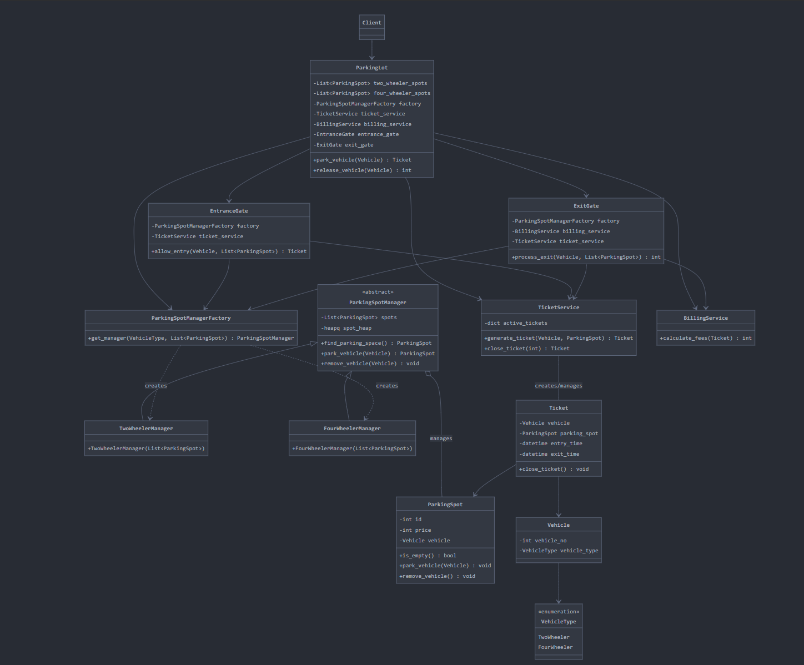

# Parking System Architecture



```mermaid
classDiagram
    %% Client
    Client --> ParkingLot

    %% Facade
    class ParkingLot {# Parking System Architecture


```mermaid
classDiagram
    %% Client
    Client --> ParkingLot

    %% Facade
    class ParkingLot {
        -List~ParkingSpot~ two_wheeler_spots
        -List~ParkingSpot~ four_wheeler_spots
        -ParkingSpotManagerFactory factory
        -TicketService ticket_service
        -BillingService billing_service
        -EntranceGate entrance_gate
        -ExitGate exit_gate
        +park_vehicle(Vehicle) Ticket
        +release_vehicle(Vehicle) int
    }

    %% Subsystem Classes
    class ParkingSpotManagerFactory {
        +get_manager(VehicleType, List~ParkingSpot~) ParkingSpotManager
    }

    class ParkingSpotManager {
        <<abstract>>
        -List~ParkingSpot~ spots
        -heapq spot_heap
        +find_parking_space() ParkingSpot
        +park_vehicle(Vehicle) ParkingSpot
        +remove_vehicle(Vehicle) void
    }

    class TwoWheelerManager {
        +TwoWheelerManager(List~ParkingSpot~)
    }

    class FourWheelerManager {
        +FourWheelerManager(List~ParkingSpot~)
    }

    class ParkingSpot {
        -int id
        -int price
        -Vehicle vehicle
        +is_empty() bool
        +park_vehicle(Vehicle) void
        +remove_vehicle() void
    }

    class TicketService {
        -dict active_tickets
        +generate_ticket(Vehicle, ParkingSpot) Ticket
        +close_ticket(int) Ticket
    }

    class BillingService {
        +calculate_fees(Ticket) int
    }

    class EntranceGate {
        -ParkingSpotManagerFactory factory
        -TicketService ticket_service
        +allow_entry(Vehicle, List~ParkingSpot~) Ticket
    }

    class ExitGate {
        -ParkingSpotManagerFactory factory
        -BillingService billing_service
        -TicketService ticket_service
        +process_exit(Vehicle, List~ParkingSpot~) int
    }

    class Ticket {
        -Vehicle vehicle
        -ParkingSpot parking_spot
        -datetime entry_time
        -datetime exit_time
        +close_ticket() void
    }

    class Vehicle {
        -int vehicle_no
        -VehicleType vehicle_type
    }

    class VehicleType {
        <<enumeration>>
        TwoWheeler
        FourWheeler
    }

    %% Relationships
    ParkingLot --> ParkingSpotManagerFactory
    ParkingLot --> TicketService
    ParkingLot --> BillingService
    ParkingLot --> EntranceGate
    ParkingLot --> ExitGate
    
    ParkingSpotManager <|-- TwoWheelerManager
    ParkingSpotManager <|-- FourWheelerManager
    
    ParkingSpotManagerFactory ..> TwoWheelerManager : creates
    ParkingSpotManagerFactory ..> FourWheelerManager : creates
    
    ParkingSpotManager o-- ParkingSpot : manages
    
    EntranceGate --> ParkingSpotManagerFactory
    EntranceGate --> TicketService
    
    ExitGate --> ParkingSpotManagerFactory
    ExitGate --> BillingService
    ExitGate --> TicketService
    
    TicketService -- Ticket : creates/manages
    
    Ticket --> Vehicle
    Ticket --> ParkingSpot
    
    Vehicle --> VehicleType# Parking System Architecture


```mermaid
classDiagram
    %% Client
    Client --> ParkingLot

    %% Facade
    class ParkingLot {
        -List~ParkingSpot~ two_wheeler_spots
        -List~ParkingSpot~ four_wheeler_spots
        -ParkingSpotManagerFactory factory
        -TicketService ticket_service
        -BillingService billing_service
        -EntranceGate entrance_gate
        -ExitGate exit_gate
        +park_vehicle(Vehicle) Ticket
        +release_vehicle(Vehicle) int
    }

    %% Subsystem Classes
    class ParkingSpotManagerFactory {
        +get_manager(VehicleType, List~ParkingSpot~) ParkingSpotManager
    }

    class ParkingSpotManager {
        <<abstract>>
        -List~ParkingSpot~ spots
        -heapq spot_heap
        +find_parking_space() ParkingSpot
        +park_vehicle(Vehicle) ParkingSpot
        +remove_vehicle(Vehicle) void
    }

    class TwoWheelerManager {
        +TwoWheelerManager(List~ParkingSpot~)
    }

    class FourWheelerManager {
        +FourWheelerManager(List~ParkingSpot~)
    }

    class ParkingSpot {
        -int id
        -int price
        -Vehicle vehicle
        +is_empty() bool
        +park_vehicle(Vehicle) void
        +remove_vehicle() void
    }

    class TicketService {
        -dict active_tickets
        +generate_ticket(Vehicle, ParkingSpot) Ticket
        +close_ticket(int) Ticket
    }

    class BillingService {
        +calculate_fees(Ticket) int
    }

    class EntranceGate {
        -ParkingSpotManagerFactory factory
        -TicketService ticket_service
        +allow_entry(Vehicle, List~ParkingSpot~) Ticket
    }

    class ExitGate {
        -ParkingSpotManagerFactory factory
        -BillingService billing_service
        -TicketService ticket_service
        +process_exit(Vehicle, List~ParkingSpot~) int
    }

    class Ticket {
        -Vehicle vehicle
        -ParkingSpot parking_spot
        -datetime entry_time
        -datetime exit_time
        +close_ticket() void
    }

    class Vehicle {
        -int vehicle_no
        -VehicleType vehicle_type
    }

    class VehicleType {
        <<enumeration>>
        TwoWheeler
        FourWheeler
    }

    %% Relationships
    ParkingLot --> ParkingSpotManagerFactory
    ParkingLot --> TicketService
    ParkingLot --> BillingService
    ParkingLot --> EntranceGate
    ParkingLot --> ExitGate
    
    ParkingSpotManager <|-- TwoWheelerManager
    ParkingSpotManager <|-- FourWheelerManager
    
    ParkingSpotManagerFactory ..> TwoWheelerManager : creates
    ParkingSpotManagerFactory ..> FourWheelerManager : creates
    
    ParkingSpotManager o-- ParkingSpot : manages
    
    EntranceGate --> ParkingSpotManagerFactory
    EntranceGate --> TicketService
    
    ExitGate --> ParkingSpotManagerFactory
    ExitGate --> BillingService
    ExitGate --> TicketService
    
    TicketService -- Ticket : creates/manages
    
    Ticket --> Vehicle
    Ticket --> ParkingSpot
    
    Vehicle --> VehicleType# Parking System Architecture


```mermaid
classDiagram
    %% Client
    Client --> ParkingLot

    %% Facade
    class ParkingLot {
        -List~ParkingSpot~ two_wheeler_spots
        -List~ParkingSpot~ four_wheeler_spots
        -ParkingSpotManagerFactory factory
        -TicketService ticket_service
        -BillingService billing_service
        -EntranceGate entrance_gate
        -ExitGate exit_gate
        +park_vehicle(Vehicle) Ticket
        +release_vehicle(Vehicle) int
    }

    %% Subsystem Classes
    class ParkingSpotManagerFactory {
        +get_manager(VehicleType, List~ParkingSpot~) ParkingSpotManager
    }

    class ParkingSpotManager {
        <<abstract>>
        -List~ParkingSpot~ spots
        -heapq spot_heap
        +find_parking_space() ParkingSpot
        +park_vehicle(Vehicle) ParkingSpot
        +remove_vehicle(Vehicle) void
    }

    class TwoWheelerManager {
        +TwoWheelerManager(List~ParkingSpot~)
    }

    class FourWheelerManager {
        +FourWheelerManager(List~ParkingSpot~)
    }

    class ParkingSpot {
        -int id
        -int price
        -Vehicle vehicle
        +is_empty() bool
        +park_vehicle(Vehicle) void
        +remove_vehicle() void
    }

    class TicketService {
        -dict active_tickets
        +generate_ticket(Vehicle, ParkingSpot) Ticket
        +close_ticket(int) Ticket
    }

    class BillingService {
        +calculate_fees(Ticket) int
    }

    class EntranceGate {
        -ParkingSpotManagerFactory factory
        -TicketService ticket_service
        +allow_entry(Vehicle, List~ParkingSpot~) Ticket
    }

    class ExitGate {
        -ParkingSpotManagerFactory factory
        -BillingService billing_service
        -TicketService ticket_service
        +process_exit(Vehicle, List~ParkingSpot~) int
    }

    class Ticket {
        -Vehicle vehicle
        -ParkingSpot parking_spot
        -datetime entry_time
        -datetime exit_time
        +close_ticket() void
    }

    class Vehicle {
        -int vehicle_no
        -VehicleType vehicle_type
    }

    class VehicleType {
        <<enumeration>>
        TwoWheeler
        FourWheeler
    }

    %% Relationships
    ParkingLot --> ParkingSpotManagerFactory
    ParkingLot --> TicketService
    ParkingLot --> BillingService
    ParkingLot --> EntranceGate
    ParkingLot --> ExitGate
    
    ParkingSpotManager <|-- TwoWheelerManager
    ParkingSpotManager <|-- FourWheelerManager
    
    ParkingSpotManagerFactory ..> TwoWheelerManager : creates
    ParkingSpotManagerFactory ..> FourWheelerManager : creates
    
    ParkingSpotManager o-- ParkingSpot : manages
    
    EntranceGate --> ParkingSpotManagerFactory
    EntranceGate --> TicketService
    
    ExitGate --> ParkingSpotManagerFactory
    ExitGate --> BillingService
    ExitGate --> TicketService
    
    TicketService -- Ticket : creates/manages
    
    Ticket --> Vehicle
    Ticket --> ParkingSpot
    
    Vehicle --> VehicleType# Parking System Architecture


```mermaid
classDiagram
    %% Client
    Client --> ParkingLot

    %% Facade
    class ParkingLot {
        -List~ParkingSpot~ two_wheeler_spots
        -List~ParkingSpot~ four_wheeler_spots
        -ParkingSpotManagerFactory factory
        -TicketService ticket_service
        -BillingService billing_service
        -EntranceGate entrance_gate
        -ExitGate exit_gate
        +park_vehicle(Vehicle) Ticket
        +release_vehicle(Vehicle) int
    }

    %% Subsystem Classes
    class ParkingSpotManagerFactory {
        +get_manager(VehicleType, List~ParkingSpot~) ParkingSpotManager
    }

    class ParkingSpotManager {
        <<abstract>>
        -List~ParkingSpot~ spots
        -heapq spot_heap
        +find_parking_space() ParkingSpot
        +park_vehicle(Vehicle) ParkingSpot
        +remove_vehicle(Vehicle) void
    }

    class TwoWheelerManager {
        +TwoWheelerManager(List~ParkingSpot~)
    }

    class FourWheelerManager {
        +FourWheelerManager(List~ParkingSpot~)
    }

    class ParkingSpot {
        -int id
        -int price
        -Vehicle vehicle
        +is_empty() bool
        +park_vehicle(Vehicle) void
        +remove_vehicle() void
    }

    class TicketService {
        -dict active_tickets
        +generate_ticket(Vehicle, ParkingSpot) Ticket
        +close_ticket(int) Ticket
    }

    class BillingService {
        +calculate_fees(Ticket) int
    }

    class EntranceGate {
        -ParkingSpotManagerFactory factory
        -TicketService ticket_service
        +allow_entry(Vehicle, List~ParkingSpot~) Ticket
    }

    class ExitGate {
        -ParkingSpotManagerFactory factory
        -BillingService billing_service
        -TicketService ticket_service
        +process_exit(Vehicle, List~ParkingSpot~) int
    }

    class Ticket {
        -Vehicle vehicle
        -ParkingSpot parking_spot
        -datetime entry_time
        -datetime exit_time
        +close_ticket() void
    }

    class Vehicle {
        -int vehicle_no
        -VehicleType vehicle_type
    }

    class VehicleType {
        <<enumeration>>
        TwoWheeler
        FourWheeler
    }

    %% Relationships
    ParkingLot --> ParkingSpotManagerFactory
    ParkingLot --> TicketService
    ParkingLot --> BillingService
    ParkingLot --> EntranceGate
    ParkingLot --> ExitGate
    
    ParkingSpotManager <|-- TwoWheelerManager
    ParkingSpotManager <|-- FourWheelerManager
    
    ParkingSpotManagerFactory ..> TwoWheelerManager : creates
    ParkingSpotManagerFactory ..> FourWheelerManager : creates
    
    ParkingSpotManager o-- ParkingSpot : manages
    
    EntranceGate --> ParkingSpotManagerFactory
    EntranceGate --> TicketService
    
    ExitGate --> ParkingSpotManagerFactory
    ExitGate --> BillingService
    ExitGate --> TicketService
    
    TicketService -- Ticket : creates/manages
    
    Ticket --> Vehicle
    Ticket --> ParkingSpot
    
    Vehicle --> VehicleType# Parking System Architecture


```mermaid
classDiagram
    %% Client
    Client --> ParkingLot

    %% Facade
    class ParkingLot {
        -List~ParkingSpot~ two_wheeler_spots
        -List~ParkingSpot~ four_wheeler_spots
        -ParkingSpotManagerFactory factory
        -TicketService ticket_service
        -BillingService billing_service
        -EntranceGate entrance_gate
        -ExitGate exit_gate
        +park_vehicle(Vehicle) Ticket
        +release_vehicle(Vehicle) int
    }

    %% Subsystem Classes
    class ParkingSpotManagerFactory {
        +get_manager(VehicleType, List~ParkingSpot~) ParkingSpotManager
    }

    class ParkingSpotManager {
        <<abstract>>
        -List~ParkingSpot~ spots
        -heapq spot_heap
        +find_parking_space() ParkingSpot
        +park_vehicle(Vehicle) ParkingSpot
        +remove_vehicle(Vehicle) void
    }

    class TwoWheelerManager {
        +TwoWheelerManager(List~ParkingSpot~)
    }

    class FourWheelerManager {
        +FourWheelerManager(List~ParkingSpot~)
    }

    class ParkingSpot {
        -int id
        -int price
        -Vehicle vehicle
        +is_empty() bool
        +park_vehicle(Vehicle) void
        +remove_vehicle() void
    }

    class TicketService {
        -dict active_tickets
        +generate_ticket(Vehicle, ParkingSpot) Ticket
        +close_ticket(int) Ticket
    }

    class BillingService {
        +calculate_fees(Ticket) int
    }

    class EntranceGate {
        -ParkingSpotManagerFactory factory
        -TicketService ticket_service
        +allow_entry(Vehicle, List~ParkingSpot~) Ticket
    }

    class ExitGate {
        -ParkingSpotManagerFactory factory
        -BillingService billing_service
        -TicketService ticket_service
        +process_exit(Vehicle, List~ParkingSpot~) int
    }

    class Ticket {
        -Vehicle vehicle
        -ParkingSpot parking_spot
        -datetime entry_time
        -datetime exit_time
        +close_ticket() void
    }

    class Vehicle {
        -int vehicle_no
        -VehicleType vehicle_type
    }

    class VehicleType {
        <<enumeration>>
        TwoWheeler
        FourWheeler
    }

    %% Relationships
    ParkingLot --> ParkingSpotManagerFactory
    ParkingLot --> TicketService
    ParkingLot --> BillingService
    ParkingLot --> EntranceGate
    ParkingLot --> ExitGate
    
    ParkingSpotManager <|-- TwoWheelerManager
    ParkingSpotManager <|-- FourWheelerManager
    
    ParkingSpotManagerFactory ..> TwoWheelerManager : creates
    ParkingSpotManagerFactory ..> FourWheelerManager : creates
    
    ParkingSpotManager o-- ParkingSpot : manages
    
    EntranceGate --> ParkingSpotManagerFactory
    EntranceGate --> TicketService
    
    ExitGate --> ParkingSpotManagerFactory
    ExitGate --> BillingService
    ExitGate --> TicketService
    
    TicketService -- Ticket : creates/manages
    
    Ticket --> Vehicle
    Ticket --> ParkingSpot
    
    Vehicle --> VehicleType
        -List~ParkingSpot~ two_wheeler_spots
        -List~ParkingSpot~ four_wheeler_spots
        -ParkingSpotManagerFactory factory
        -TicketService ticket_service
        -BillingService billing_service
        -EntranceGate entrance_gate
        -ExitGate exit_gate
        +park_vehicle(Vehicle) Ticket
        +release_vehicle(Vehicle) int
    }

    %% Subsystem Classes
    class ParkingSpotManagerFactory {
        +get_manager(VehicleType, List~ParkingSpot~) ParkingSpotManager
    }

    class ParkingSpotManager {
        <<abstract>>
        -List~ParkingSpot~ spots
        -heapq spot_heap
        +find_parking_space() ParkingSpot
        +park_vehicle(Vehicle) ParkingSpot
        +remove_vehicle(Vehicle) void
    }

    class TwoWheelerManager {
        +TwoWheelerManager(List~ParkingSpot~)
    }

    class FourWheelerManager {
        +FourWheelerManager(List~ParkingSpot~)
    }

    class ParkingSpot {
        -int id
        -int price
        -Vehicle vehicle
        +is_empty() bool
        +park_vehicle(Vehicle) void
        +remove_vehicle() void
    }

    class TicketService {
        -dict active_tickets
        +generate_ticket(Vehicle, ParkingSpot) Ticket
        +close_ticket(int) Ticket
    }

    class BillingService {
        +calculate_fees(Ticket) int
    }

    class EntranceGate {
        -ParkingSpotManagerFactory factory
        -TicketService ticket_service
        +allow_entry(Vehicle, List~ParkingSpot~) Ticket
    }

    class ExitGate {
        -ParkingSpotManagerFactory factory
        -BillingService billing_service
        -TicketService ticket_service
        +process_exit(Vehicle, List~ParkingSpot~) int
    }

    class Ticket {
        -Vehicle vehicle
        -ParkingSpot parking_spot
        -datetime entry_time
        -datetime exit_time
        +close_ticket() void
    }

    class Vehicle {
        -int vehicle_no
        -VehicleType vehicle_type
    }

    class VehicleType {
        <<enumeration>>
        TwoWheeler
        FourWheeler
    }

    %% Relationships
    ParkingLot --> ParkingSpotManagerFactory
    ParkingLot --> TicketService
    ParkingLot --> BillingService
    ParkingLot --> EntranceGate
    ParkingLot --> ExitGate
    
    ParkingSpotManager <|-- TwoWheelerManager
    ParkingSpotManager <|-- FourWheelerManager
    
    ParkingSpotManagerFactory ..> TwoWheelerManager : creates
    ParkingSpotManagerFactory ..> FourWheelerManager : creates
    
    ParkingSpotManager o-- ParkingSpot : manages
    
    EntranceGate --> ParkingSpotManagerFactory
    EntranceGate --> TicketService
    
    ExitGate --> ParkingSpotManagerFactory
    ExitGate --> BillingService
    ExitGate --> TicketService
    
    TicketService -- Ticket : creates/manages
    
    Ticket --> Vehicle
    Ticket --> ParkingSpot
    
    Vehicle --> VehicleType